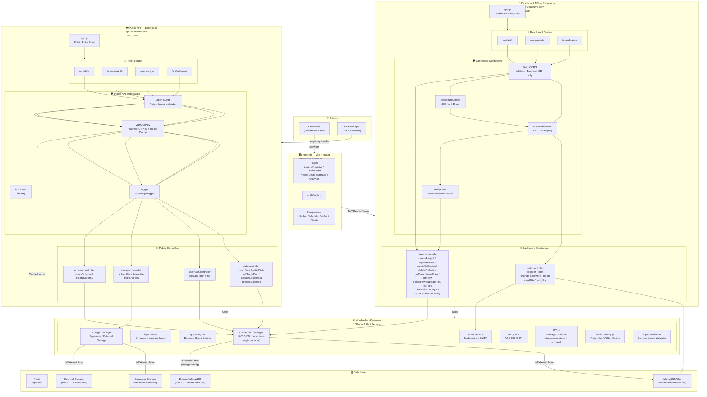
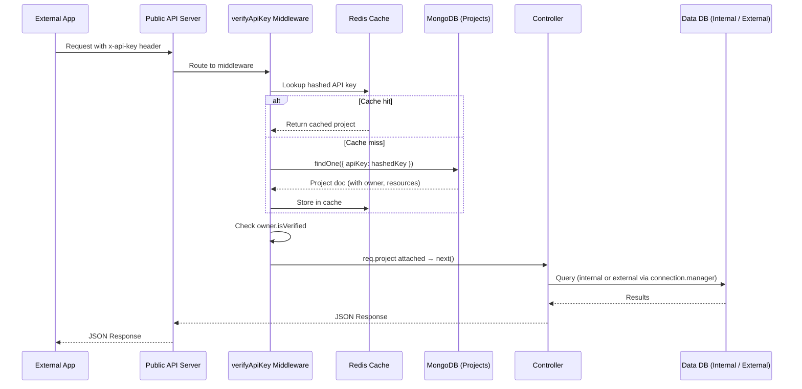
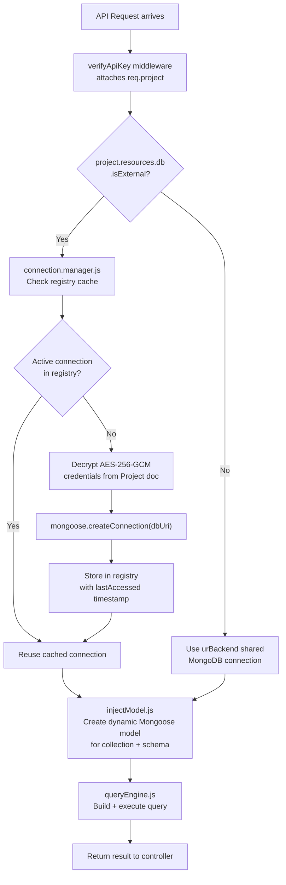
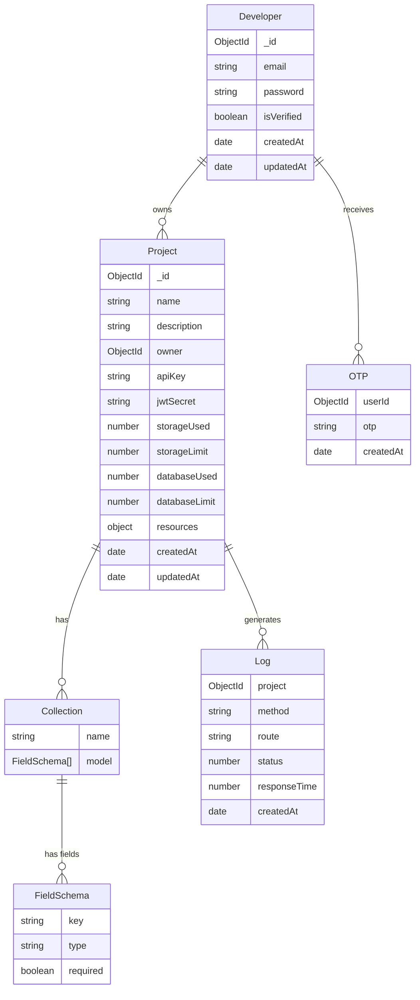
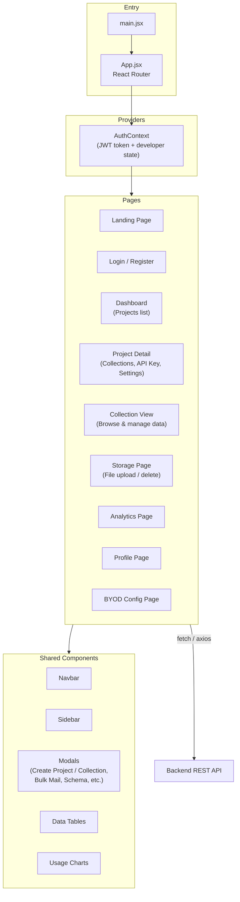
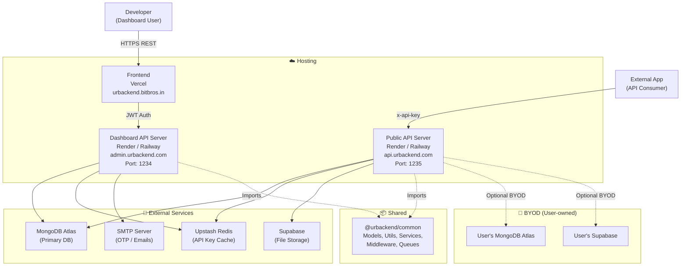

# urBackend — Architecture Diagram

## 1. System Overview

---

## 2. API Request Flow — External App (API Key)

**Public API Server Flow**

---

## 3. BYOD (Bring Your Own Database/Storage) Flow

---

## 4. MongoDB Data Models

---

## 5. Frontend Structure (Vite + React)

---

## 6. Security & Rate Limiting

| Server | Layer | Mechanism | Limit / Detail |
|---|---|---|---|
| **Dashboard API** | Dashboard routes | `dashboardLimiter` | 1000 req / 15 min |
| **Dashboard API** | Developer auth | JWT (`authMiddleware`) | Bearer token, signed per dev |
| **Dashboard API** | Email verification gate | `verifyEmail` | `owner.isVerified` must be `true` |
| **Dashboard API** | CORS | Strict whitelist | `FRONTEND_URL` only (urbackend.bitbros.in) |
| **Public API** | API consumer routes | `limiter` (custom) | Configurable per project |
| **Public API** | API consumer auth | `verifyApiKey` | SHA-256 hashed key + Redis cache |
| **Public API** | CORS | Open CORS | Project-based, allows any origin |
| **Both** | Credential storage | AES-256-GCM encryption | BYOD DB/Storage configs encrypted in MongoDB |
| **Both** | File uploads | `multer` memory storage | 10 MB per file limit |
| **Both** | Request monitoring | Kiroo SDK | Session replay & error tracking |

---

## 7. Infrastructure Overview

### Deployment Strategy

- **Dashboard API**: Handles developer/admin operations (auth, project management, releases)
- **Public API**: Handles external app requests (data CRUD, user auth, storage, schemas)
- **Shared Package**: `@urbackend/common` contains all shared code (models, utils, services)
- **Independent Scaling**: Each server can scale independently based on traffic
- **Fault Isolation**: If one server fails, the other continues to operate
- **Different Domains**: Separate domains for clear separation of concerns
